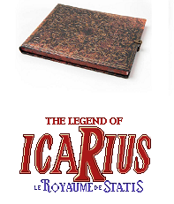
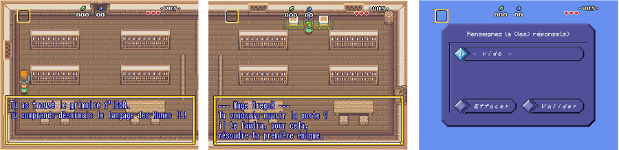

 
 

Soyez le/la bienvenu(e) au Funcamp R. Cette page rassemble les supports pédagogiques relatifs à la formation à laquelle vous prendrez part pendant la journée. Pardon : cette page ouvre le grimoire IGoR, qui vous accompagnera dans l'épopée statistico-ludique dont vous êtes le héros / l'héroïne. Vous y trouverez, distillée au fur et à mesure des chapitres enluminés, toute la sagesse accumulée par ces mages qui, dans l'ombre, ont imaginé les épreuves que vous aurez à franchir. 

 

Parcourir ce grimoire vous permettra d'apprendre, pas à pas, le langage des Runes, nécessaire pour aider le jeune icaRius, votre alter-ego numérique, à sauver le royaume de Statis de la menace qui le guette. Au cours de cette aventure, il vous sera ainsi demandé de résoudre des énigmes, dont la solution vous permettra d'avancer un peu plus loin dans les terres de Statis. Ces énigmes sont autant d'étapes pour découvrir les possibilités (magiques!) offertes par R. La solution sera ensuite à renseigner dans l'écran du jeu icaRius, prévu à cet effet.

 

Au fait, il est temps de démarrer votre partie d'IcaRius. Pour cela, double-cliquez sur l'icone icaRius dans le répertoire de la clé USB - que vous pourrez emporter avec vous à l'issue de la partie, pour rejouer à loisir ;-)  

Au bout de quelques minutes de jeu, vous rencontrerez le Mage DregoR, qui vous proposera de résoudre une première énigme. Voici la question posée : *"quel est l'âge d'icaRius ?"*. Pour y répondre, vous découvrirez en quelques lignes l'histoire de R et vous apprendrez à réaliser vos premières opérations, comme dans une super calculatrice... 
 

 

**Ouvrez le chapitre 1 d'IGoR après la rencontre avec le Mage DregoR**

\ 

Ce grimoire a été écrit à l'encre de RStudio avec [R Markdown](http://rmarkdown.rstudio.com/) et s'est trouvé estampillé le `r format(Sys.Date(), format="%d/%m/%Y")`. Ses enluminures s'inspirent du livre d'heure de Martin Chevalier (un mage de niveau 60) pour découvrir R, disponible à l'adresse [http://r.slmc.fr](http://r.slmc.fr/).

\ 
