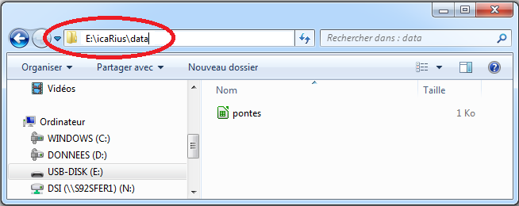

```{r setup, include=FALSE}
rm(list=ls())
library(learnr)
library(knitr)
knitr::opts_chunk$set(echo = TRUE)

file.copy(from = system.file(package = "funcampR","data","registre_pontes.csv"),
          to = "registre_pontes.csv")


```


## Le livre de compte, un fichier de données

Vous venez de rencontrer la fermière du village Kokoro, désespérée d'avoir perdu le livre de compte où, chaque jour, elle note consciencieusement le nombre de pontes. 

<span style="color:#18AC3E;font-size:16px">**Une histoire de séparateur**</span>

Aidons IcaRius à reconstituer le livre de compte. Ce dernier n'est pas tout à fait perdu : il en reste une copie, dans un format ancestral que les habitants de Kokoro ont visiblement oublié, depuis que les Runes ont été dérobées par SaSSoS : le format CSV. Nous allons donc apprendre, en R, à lire un fichier CSV. Au fait, c'est quoi ? 

CSV, c'est un format de fichier où chaque enregistrement apparaît sur sa propre ligne et dont les champs sont séparés par un caractère unique appelé “séparateur”. En l'occurrence, le séparateur est une virgule ou un point-virgule : c'est d'ailleurs le sens de l'acronyme CSV, pour Comma Separated Value (Comma = virgule en anglais). 

<span style="color:#18AC3E;font-size:16px">**Un exemple de fichier CSV**</span>

Revenons à nos poules. Bonne nouvelle : IcaRius a trouvé, dans le poulailler, un document CSV qui pourrait bien nous aider à reproduire le livre de compte. 

<table style="width:400px">.
<tbody>
<tr>
  <th width="45%">Fichier au format .csv</th>
  <th width="10%"></th>
  <th width="45%">Représentation tabulaire</th>
</tr>
<tr valign="top">
  <td>
    <pre>Jour,Poule,Pontes
Lundi,Kokot,2
Lundi,Madame Mim,3
Lundi,Chickitta,2
Lundi,Clara Cluck,4</pre>
  </td>
  <td></td>
  <td>
  <table style="width:180px ;border: 1px solid black; border-collapse:collapse; text-align:center;">
    <tbody>
      <tr>
        <th scope="col">Jour</th>
        <th scope="col">Poule</th>
        <th scope="col">Pontes</th>
      </tr>
      <tr>
        <td>Lundi</td>
        <td>Kokot</td>
        <td>3</td>
      </tr>
      <tr>
        <td>Lundi</td>
        <td>Madame Mim</td>
        <td>4</td>
      </tr>    
      <tr>
        <td>Lundi</td>
        <td>Chickitta</td>
        <td>2</td>
      </tr>
      <tr>
        <td>Lundi</td>
        <td>Clara Cluck</td>
        <td>4</td>
      </tr>
    </tbody>
  </table>
  </td>
</tr>
</tbody>
</table>

Un fichier CSV peut être produit de multiples manières, et a l'avantage d'être utilisable aussi bien avec un tableur comme Excel ou Calc qu'avec des logiciels statistiques comme R. Vous pouvez même créer un fichier CSV "à la main", juste avec le Notepad dans windows par exemple.


## Chargeons le fichier

Pour charger un fichier, nous allons utiliser une fonction prévue à cet effet dans R. La fonction `read.csv()` permet, comme son nom l'indique, de lire (*read*) un fichier CSV.

Nous l'avons vu au chapitre précédent : une fonction a des paramètres. Pour `read.csv`, il y a deux paramètres obligatoires : l’emplacement du fichier à lire et le type de séparateur du fichier.

```{r, collapse = TRUE, eval=FALSE}
ma_table<-read.csv(file="chemin_du_fichier", sep="separateur_du_fichier")
```

Le chemin du fichier doit préciser l'emplacement du document csv que vous cherchez à ouvrir, sur votre poste de travail par exemple. Cherchons donc l'emplacement à partir  de l'explorateur dans windows. 



<p style="border:1px; border-style:solid; border-color:#000000; padding: 1em;">
**Attention :** pour spécifier le chemin d’un fichier, il va falloir jongler avec les signes cabalistiques que sont les `/` et les `\` (ça ne s'appelle pas le langage des Runes pour rien). Contrairement à Windows (ou SAS) où le backslash `\` est utilisé pour écrire un chemin, en R il faut écrire avec un slash `/`. Pensez donc à modifier le chemin du répertoire lors d'un copier coller de ce dernier depuis l’explorateur. Enfin, n'oubliez pas d'ajouter à la fin le nom du fichier (pontes) avec son extension (.csv). 
</p>


Dans l'exemple ci-dessus, la bonne adresse pour notre fichier de ponte c'est donc `E:/icaRius/data/pontes.csv`. Il nous reste à préciser le séparateur, qui est ici une virgule `,`. C'est parti :

```{r, collapse = TRUE}
# mon_fichier <- read.csv(file="E:/icaRius/data/pontes.csv", sep=",")
mon_fichier <- read.csv(system.file(package = "funcampR","data","pontes.csv"), sep=",")
```

<span style="color:#18AC3E;font-size:16px">**A vous de jouer**</span> 

Chargez vous-mêmes le fichier `pontes.csv` qui se trouve dans le répertoire `E:\icaRius\data` dans une table nommée `mon_fichier`

```{r module2-question1,exercise=TRUE}
# Charger le ficher pontes.csv

``` 
 
<div id="module2-question1-hint">
**Aide 1:** Utiliser la fonction read.csv(file=,sep=). Veillez à indiquer le bon chemin (file=) vers le fichier et son séparateur (sep=) qui est une virgule (,)
</div>


## Découvrons le contenu du fichier

Nous voilà avec un fichier chargé dans R. 

<span style="color:#18AC3E;font-size:16px">**Affichage des premières lignes du fichier**</span> 

Pour afficher les premières lignes du fichier, nous allons utiliser la fonction `head()` (head = tête, début), en lui indiquant comme paramètre le nom du fichier tel que nous l'avons choisi, ici `mon_fichier`.

```{r, collapse = TRUE}
# Affichage des premières lignes contenues dans le fichier
head(mon_fichier) 
```

<span style="color:#18AC3E;font-size:16px">**Affichage du nom des variables**</span> 

La fonction `names()` permet de connaître les différentes variables comprises dans un fichier, ou dit autrement de connaître le nom des colonnes du tableau de données : 

```{r, collapse = TRUE}
# Affichage du nom des variables
names(mon_fichier) 
```

Notre registre des pontes comporte 3 variables : le jour de ponte `Jour`, l'appellation de la poule `Poule` et le nombre d'oeufs pondus `Oeufs`. 

<span style="color:#18AC3E;font-size:16px">**Affichage du nombre de lignes**</span> 

Reste à savoir combien d'observations - combien de lignes - comprend notre tableau de données. Mot à mot, nous voulons connaître le **n**ombre de lignes (**row** en anglais), d'où la fonction `nrow()`

```{r, collapse = TRUE}
# Affichage du nombre de lignes (nombre d'observations)
nrow(mon_fichier) 
```

Il y a 28 enregistrements dans le registre (28 lignes dans le tableau de données).

<span style="color:#18AC3E;font-size:16px">**A vous de jouer**</span> 

Manipulez vous-même le fichier des pontes utilisés dans ce tutoriel.

```{r,  echo=FALSE}
mon_fichier <- read.csv(file=system.file(package = "funcampR","data","pontes.csv"), sep=",")
```

```{r module2-question2,exercise=TRUE}
# Le fichier 'pontes.csv' est déjà chargé dans R dans l'objet 'mon_fichier'
# Calculer le nombre de lignes de l'objet 'mon_fichier'

# Afficher le nom des variables de l'objet 'mon_fichier'

# Fin de l'exercice
``` 

```{r module2-question2-solution}
# Le fichier 'pontes.csv' est déjà chargé dans R dans l'objet 'mon_fichier'
# Calculer le nombre de lignes de l'objet 'mon_fichier'
nrow(mon_fichier)
# Afficher le nom des variables de l'objet 'mon_fichier'
names(mon_fichier)
# Fin de l'exercice
``` 


## Calculons le nombre d'oeufs pondus

<span style="color:#18AC3E;font-size:16px">**Accéder à une variable dans un fichier**</span> 

Notre fichier se compose de 3 variables (3 colonnes), qui ont chacune un nom : `Jour`, `Poule`, `Oeufs`. Une variable nommée `NomVariable` au sein d'un fichier `NomFichier` est accessible dans R comme un objet nommé `NomFichier$NomVariable`. C'est donc le signe `$` (encore un signe cabalistique) placé entre le nom du fichier et le nom de la variable qui permet d'indiquer à R que l'on souhaite accèder au contenu de cette variable.

Par exemple, le contenu de la variable `Oeufs` est accessible via `mon_fichier$Oeufs` : dans ce cas, R va me présenter l'ensemble des informations dans la colonne correspondante du tableau.

```{r, collapse = TRUE}
# Affichage des valeurs de la variable Oeufs
mon_fichier$Oeufs
```

Soyez vigilant(e) : R prend en compte les minuscules et les majuscules. Par exemple, dans le registre, les variables commencent par une majuscule. L'oublier va provoquer une erreur :

```{r, collapse = TRUE}
# Erreur sur le nom de la variable (o minuscule au lieu de O majuscule)
mon_fichier$oeufs
```

<span style="color:#18AC3E;font-size:16px">**Connaître les valeurs d'une variable**</span> 

Une variable peut présenter des valeurs récurrentes, que l'on appelle des modalités. Par exemple, le poulailler ne comprend que 4 poules, chacune avec leur petit nom. Le nom d'une poule est une modalité de la variable `mon_fichier$Poule`. Si je veux connaître la liste des prénoms des poules (la liste des modalités de la variable `Poule`), j'utilise la fonction `levels` (level = niveau, une modalité étant comme un "niveau" dans une liste de valeurs possibles).

```{r, collapse = TRUE}
# Quels sont les noms des poules pondeuses ?
levels(mon_fichier$Poule) 
```

<span style="color:#18AC3E;font-size:16px">**Sommer une variable**</span> 

Chaque ligne du registre indique le nombre d'oeufs pondus pour une poule et pour un jour de la semaine. Pour savoir le nombre d'oeufs pondus (enfin !), il vous reste à sommer les valeurs de la variable `Oeufs` avec la fonction `sum()` (somme en anglais)

```{r, collapse = TRUE}
# Combien d'oeufs ont été pondus au total selon le registre ?
sum(mon_fichier$Oeufs) 
```

Gagné ! Il y a 81 oeufs pondus selon le registre.


## A vous de calculer le nombre d'oeufs

**Sauf que... toutes ces explications portaient sur un faux registre !** A vous désormais d'appliquer ces calculs sur le véritable registre, qui figure dans votre répertoire ici : `E:/icaRius/data/registre_pontes.csv`.

<span style="color:#18AC3E;font-size:16px">**Chargez le fichier 'registre_pontes.csv' et explorez son contenu**</span>


```{r module2-question3,exercise=TRUE}
# Chargez le ficher 'registre_pontes.csv' dans un objet appelé 'registre'

# Affichez le nom des variables de l'objet 'registre'

# Affichez les premières lignes de l'objet 'registre'

# fin de l'exercice
``` 
 
```{r module2-question3-solution}
# Charger le ficher 'registre_pontes.csv' dans un objet appelé 'registre'
registre <- read.csv(file="registre_pontes.csv", sep=",")
# Connaitre le nom des variables
names(registre)
# Affichage des premières lignes
head(registre)
# fin de l'exercice
``` 

<div id="module2-question3-hint">
**Aide 1:** Utiliser la fonction read.csv(file=,sep=). Veillez à indiquer le bon chemin (file=) vers le registre et son séparateur (sep=) qui est une virgule (,)
**Aide 2:** Utiliser la fonction names()
**Aide 3:** Utiliser la fonction head()
</div>


<span style="color:#18AC3E;font-size:16px">**Calculer le nombre total des pontes**</span> 

```{r,  echo=FALSE}
registre <- read.csv(file=system.file(package = "funcampR","data","registre_pontes.csv"), sep=",")
```

```{r module2-question4,exercise=TRUE}
# Le registre des pontes est déjà chargé dans l'objet 'registre'
# La variable sur le nombre de pontes par jour s'appelle 'Oeufs'
# Calculer la somme de la variable Oeufs


# Fin de l'exercice
``` 

<div id="module2-question4-hint">
**Aide:** Utiliser la fonction sum()
</div>


```{r question1,echo=FALSE}
question("Alors, quel est le total des pontes ? Ne reste plus qu'à cocher la bonne réponse...pour poursuivre l'aventure!",
type="single",
allow_retry = TRUE,
incorrect="Retente ta chance",
answer("67"),
answer("78"),
answer("91",correct=TRUE),
answer("La bonne réponse n'est pas dans les propositions"),
correct="Félicitations, tu as trouvé le total des pontes, l'aventure peut continuer!"
)

```   

Vous avez trouvé ? **Reportez le nombre total de pontes dans le jeu Icarius** pour reprendre la partie...

**Fin du chapitre 2 >> reprenez la partie d'Icarius !!!** 