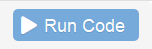

```{r setup, include=FALSE}
library(learnr)
library(parsons)
knitr::opts_chunk$set(echo = FALSE)
# zelda <- readr::read_rds(path = "www/zelda.rds")
# prenoms <- readr::read_rds(path = "www/prenoms.rds")
tutorial_options(exercise.completion = FALSE)


zelda <- readr::read_rds(path = system.file("dataset","zelda.rds",package = "funcampR"))

library(prenoms)
data("prenoms")

```


# Premières conversations runiques

## Objectifs

Dans ce premier module, nous allons progressivement : 

- comprendre ce qu'est-ce le fameux langage runique R

- entamer les premiers dialogues avec R via une fenêtre de saisie : la console

- et nous familiariser avec quelques uns des tics de langages de R

En cas de besoin, n'hésitez pas à solliciter un animateur circulant dans la salle.


## Qu'est-ce que R ?

R est un langage utilisé pour le traitement de données statistiques, dont la première version a été publiée en février 2000 par Robert Gentleman et Ross Ihaka. D'abord principalement diffusé parmi les chercheurs, R est aujourd'hui de plus en plus utilisé au sein des Instituts nationaux de statistiques.

R permet de faire des **calculs statistiques**, de les restituer sous forme de **tableaux** et également de tracer des **graphiques** et des cartes géographiques. Les résultats produits dans R peuvent être exportés dans des **rapports** et même être intégrés dans des **applications web** en ligne.


À la différence d'autres logiciels comme SAS, R est un **logiciel libre** : sa licence d'utilisation est gratuite et autorise chaque utilisateur à **accéder, modifier ou redistribuer son code source**.
Le code source est l'équivalent du mode d'emploi pour la fabrication du logiciel. 
Il est aussi **multi-plateforme**. Cela signifie qu'il peut être executé sur plusieurs systèmes d'exploitation (Windows, MacOS, Linux...)


<!-- Une des conséquences de cette philosophie "libre" est le rôle qu'y jouent les modules complémentaires, ou **packages**. Ces packages enrichissent considérablement les fonctionnalités du logiciel : comme d'avoir une calculatrice à laquelle on peut ajouter de nouveaux boutons pour la personnaliser pour ses besoins... -->

## Quiz


```{r quiz}
quiz(
  question("Qu'est-ce que R ne fait PAS ?",
    answer("de très beaux graphiques"),
    answer("des calculs statistiques"),
    answer("de très belles cartes géographiques"),
    answer("le café", correct = TRUE),
    answer("des applications web")
  ),
  question('Que signifie "logiciel libre" ?',
    answer("un logiciel libre est un logiciel sauvage, on ne le trouve pas à l'état domestique"),
    answer("un logiciel libre est un logiciel qui autorise librement l'utilisation, l'étude, la modification et la redistribution", correct = TRUE),
    answer("un logiciel libre est un logiciel qu'on a vu voler")
  )
)
```


## Premiers pas dans la console

Sous ces lignes se trouve une **console** R et, à la manière d'une calculatrice, il est possible de lui demander de réaliser des calculs pour nous : tapez ci-dessous, dans la console, un calcul tel que `2 + 2` et appuyez sur le bouton "Run Code"  en haut à droite de la console pour faire executer le code  et trouver la réponse en dessous : 


```{r two-plus-two, exercise=TRUE}

```

R  répond `4` et heureusement ! A l'avenir nous allons lui faire faire des choses beaucoup plus compliquées...


> Notez que quand R répond à vos demandes, il commence toutes ses "phrases" par un numero de ligne, ici `[1]`

Voici une console un peu plus grande qui contient des instructions pré-remplies, exécutez-les toujours avec le bouton  pour voir comment R structure sa réponse à votre sollicitation :

```{r several_instructions, exercise=TRUE, exercices.lines = 10}
2 + 2
2+2
   2    +   2
   2    -   2
12345678 * 4

```


La console est un lieu de dialogue, vous commandez et R s'exécute !
Remarquons qu'il y a une réponse par instruction passée et que le nombre d'espaces est sans importance.   
`*` est l'opérateur de multiplication. Les autres opérateurs utiles sont `-` pour la soustraction et  `/` pour la division.

Essayez quelques calculs par vous-même : 

```{r error_is_ok, exercise=TRUE}

```

## Afficher un tableau 

Vos conversations dans le langage runique sont pour l'instant très limitées. 
Ce n'est pas ainsi que nous allons trouver le nombre d'enfants prénommés "Zelda" au royaume de Statis en 1985 ! 


Poursuivons notre dialogue avec R : nous allons lui demander d'afficher notre premier **tableau de données**. Après tout, c'est avec cette matière que nous allons avancer dans notre quête au royaume de Statis.  

Le jeu de données des prénoms donnés aux statisiens depuis 1900 a été importé dans R, pour le faire apparaître, il suffit de taper `prenoms` dans la console : 

```{r prenoms, exercise=TRUE}

```

Nous avons sous les yeux un jeu de données qui comporte `r nrow(prenoms)` lignes et `r ncol(prenoms)` colonnes. Nous l'avons fait apparaître en tapant son nom (`prenoms`) dans la console.

> R n'en affiche que les 10 premières lignes et nous informe de sa taille d'emblée au moyen de ce descriptif : `# A tibble: 3,712,763 x 6` 

Nous appellerons les colonnes `r ncol(prenoms)` des **variables** et les `r nrow(prenoms)` lignes des **observations**. 

Examinons les variables en présence : 

- ``r names(prenoms)[1]`` est l'année où le prénom a été recensé

- ``r names(prenoms)[2]`` est le sexe de l'enfant à la naissance

- ``r names(prenoms)[3]`` est le prénom donné à l'enfant

- ``r names(prenoms)[4]`` correspond au nombre d'enfants nés une année donnée pour un prénom donné, c'est l'effectif

- ``r names(prenoms)[5]`` est le département de naissance de l'enfant

- ``r names(prenoms)[6]`` est la proportion d'enfants portant ce prénom pour une année et un département donné (il s'agit de l'effectif divisé par la somme des naissances dans le département)


> (à voir ici si on conserve la colonne département et proportion) 

<!-- R, comme beaucoup de langage de programmation, est intransigeant et intolérant à l'erreur. Remarquez que si vous tapez `PRENOMS` ou même `Prenoms` au lieu de `prenoms`, R retourne un message d'erreur -->

<!-- ```{r give_it_a_try, exercise=TRUE} -->

<!-- ``` -->

<!-- Pas de panique toutefois, tous les apprenants peuvent se tromper ! Même les grands mages de niveau 60 écopent de fin de non recevoir de la part de R. Heureusement, s'il est inflexible, il n'est pas rancunier et mages comme apprentis peuvent solliciter R à l'envi sans risque -->


## Les Zelda de 1985

Si nous disposons du jeu de données `prenoms`, il est difficile pour l'instant de répondre à la question qui nous intéresse ici : combien d'enfants ont été prénommés "Zelda" au royaume de Statis en 1985 ?

Nous apprendrons plus tard dans notre périple au royaume de Statis à filtrer des tableaux selon les critères qui nous intéressent. En attendant, le jeu de données `zelda` est mis à notre disposition pour répondre à la question qui nous brûle les lèvres. 

Saurez-vous afficher le jeu de données `zelda` dans la console ? 

```{r zelda, exercise=TRUE}

```
 

```{r nombre_zelda}
quiz(
  question("Combien d'enfants nés en 1985 sont prénommés Zelda ?",
    answer("3"),
    answer("0"),
    answer("12", correct = TRUE)
  ))
```


## Puzzle

Ceci est un test pour l'utilisation des puzzles de parsons : 


Mettre les blocs dans le bon ordre  :

```{r puzzle1} 
question_parsons(
  initial = c(
    "iris",
    "mutate(...)",
    "summarize(...)",
    "print()"
  ),
  pass_if(
    c(
      "iris",
      "mutate(...)",
      "summarize(...)"
    )
  ),
  fail_if(
    ~length(.) < 2,
    message = "Include at least two answers"
  ),
  fail_if(
    function(x){"print()" %in% x},
    message = "You should not include print() in your answer"
  ),
  fail_if(
    ~{.[1] != "iris"},
    message = "Your solution should start with 'iris'"
  )
)
```

